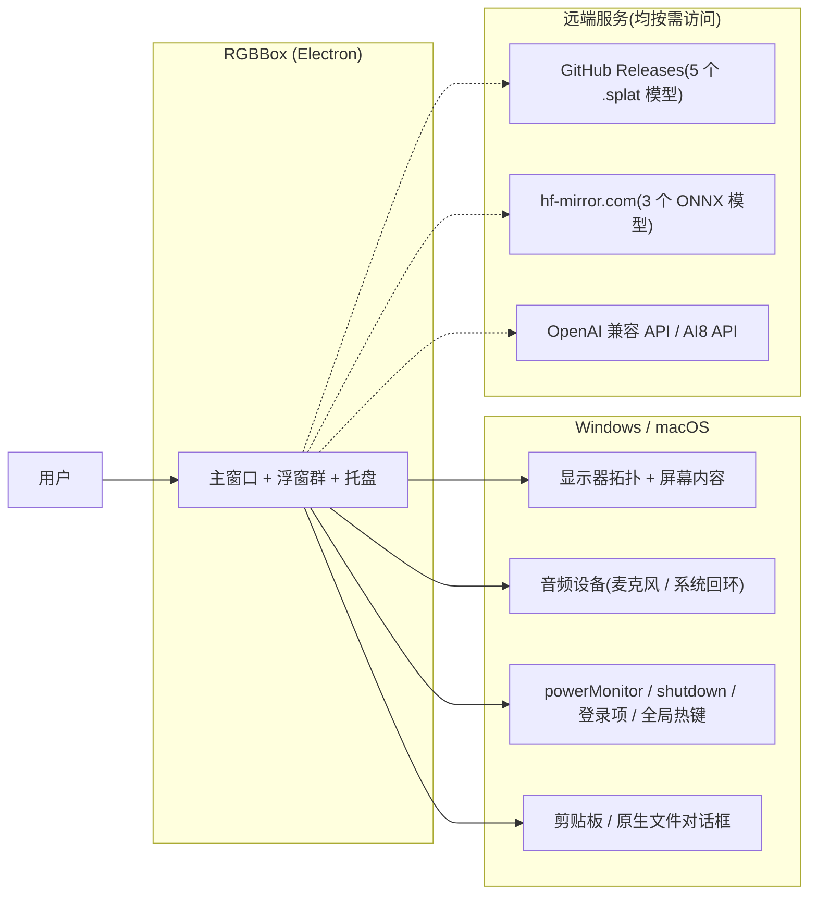
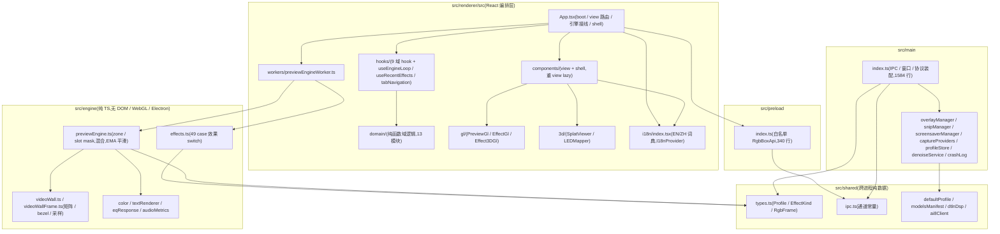
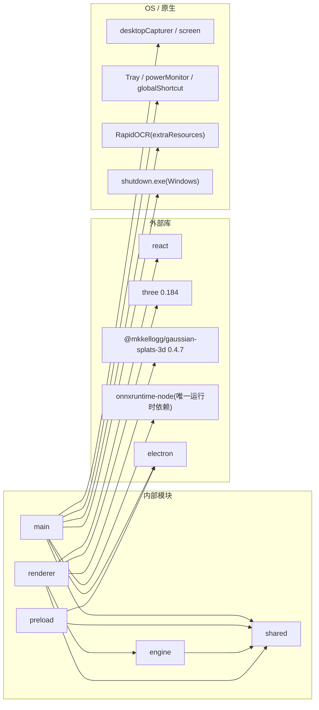
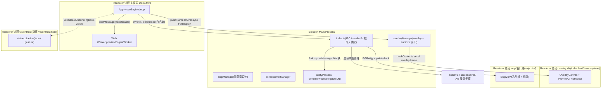
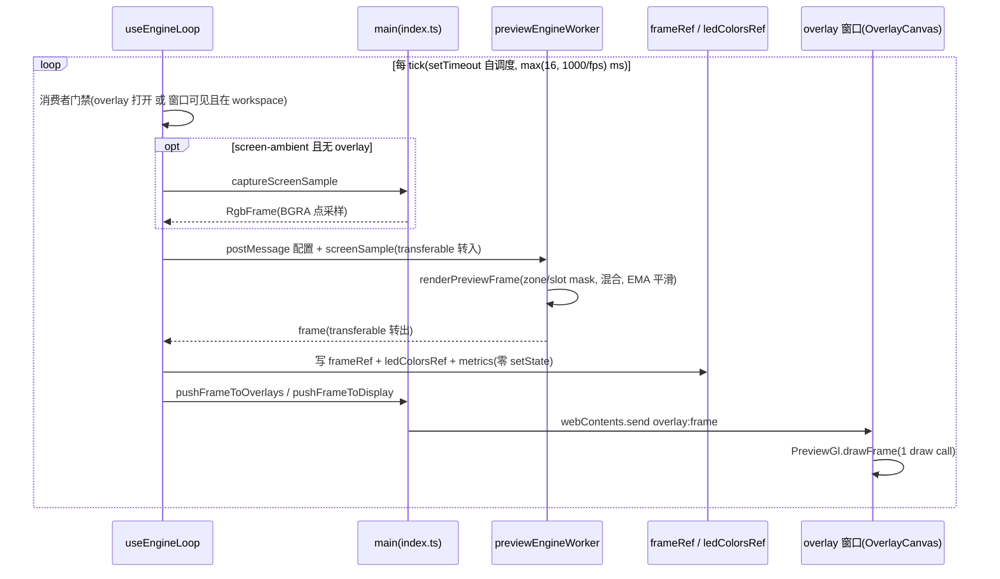
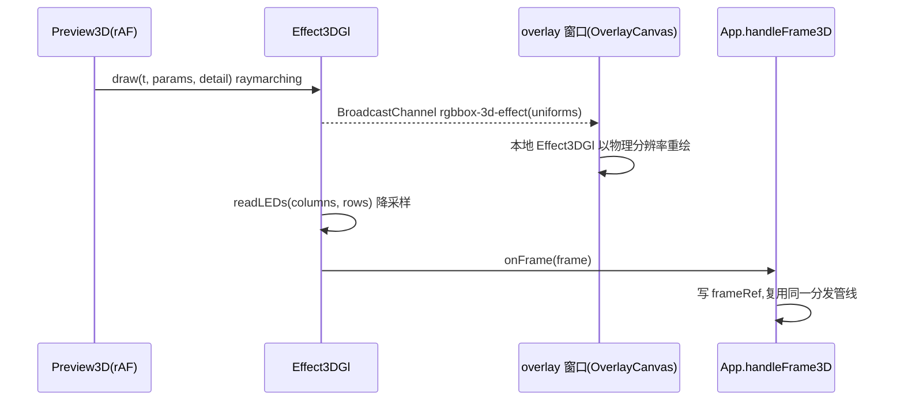
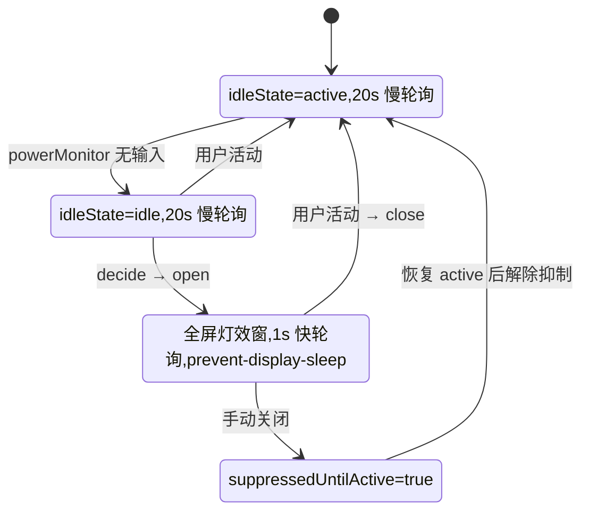
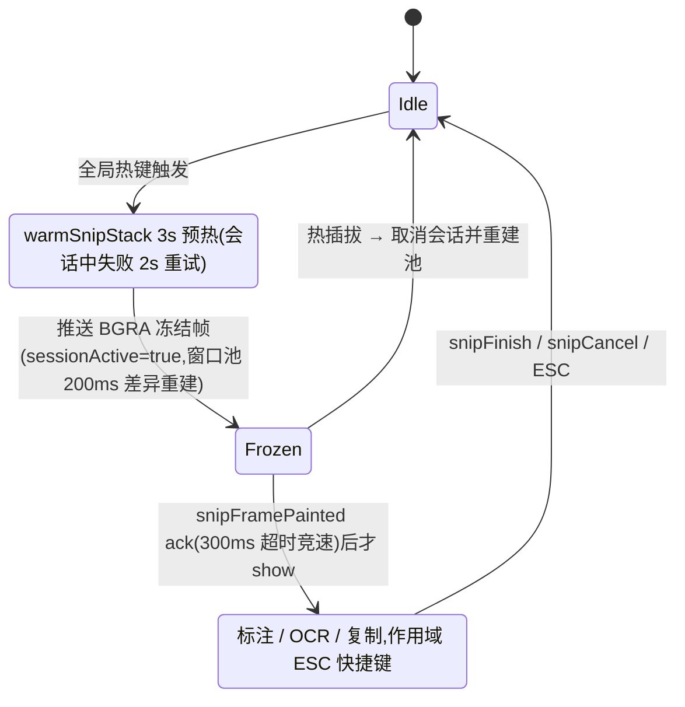
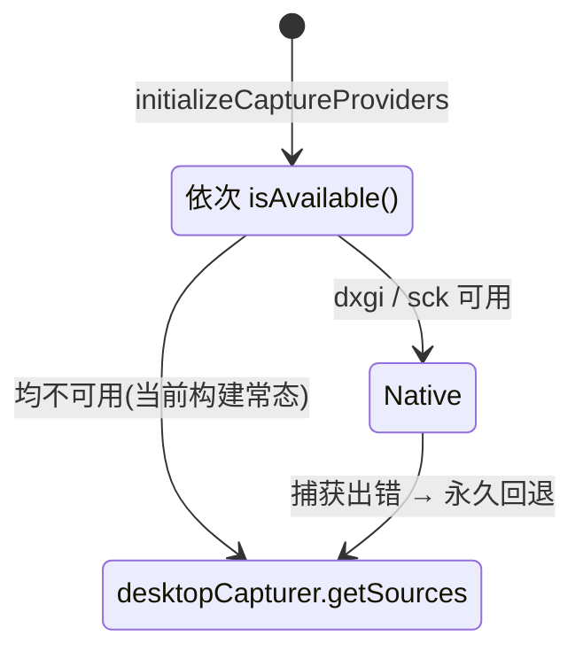
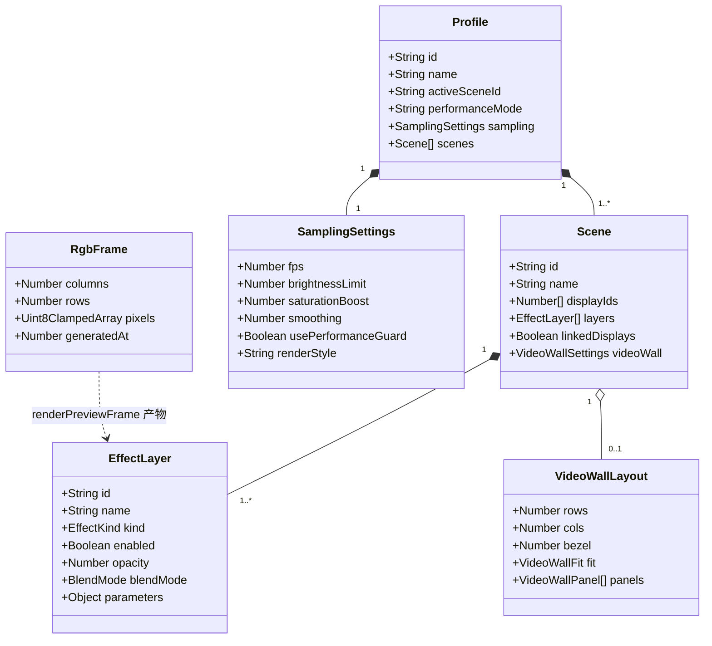

# RGBBox 架构文档

> **基线**:main @ `f82ef25`(v0.3.82,2026-09-24;R150–R164 增量刷新,首版 2026-09-22 @ `c01095c`)
> **范围**:Electron 桌面 RGB 灯效客户端全系统(主进程 / preload / renderer / engine / 构建打包)
> **方法**:三路代码事实采集(main / renderer / engine+shared+build),未经代码确认的推断一律标注 `(推断)` 并汇总到 §14
> **配套**:流程与需求见 [AI_WORKFLOW](./AI_WORKFLOW.md) 与 [PRD-0002](./prd/PRD-0002-rgbbox-project-catalog.md);渲染层拆分设计见 [R147 设计文档](./superpowers/specs/2026-09-21-r147-renderer-architecture-design.md)

---

## 1. Overview

RGBBox 是一个把「屏幕内容 / 音频 / 效果参数」渲染成 RGB 灯效帧,并分发到多显示器浮窗、LED 预览与 3D 场景的 Electron 桌面应用。架构核心是一条 **renderer 侧引擎循环**:React 只做编排,帧数据全程走 ref 与 transferable 零拷贝,主进程仅做窗口生命周期与帧中继。

## 2. Architecture Context

远端仅三类:模型资产(GitHub Releases / hf-mirror)与 AI 推理 API(OpenAI 兼容 + AI8)。OCR(RapidOCR)与降噪(DTLN ONNX)在本地执行,不依赖远端。

## 3. Logical Architecture

分层只有一条铁律方向:renderer → (preload 桥) → main;engine 与 shared 是被依赖方,不反向依赖任何运行时。

## 4. Component Responsibilities

| Component | 负责 | 不负责 |
|---|---|---|
| `App.tsx`(795 行) | boot fan-out、`View` 路由、`useEngineLoop` 接线(全 ref)、shell 装配、keep-alive 门控 | 域状态(在域 hook)、帧计算(engine)、帧上屏(gl)、`selectEffect`/`applyAmbientPreset` 之外的效果编辑逻辑 |
| `hooks/domains/*`(9 个) | 各域 state + 副作用 + 持久化(profile 槽位 / overlay 拓扑 / 计划 / 自动化 / 随机器 / 图层动作 / 关机 / 设置镜像 / 采样) | 跨域编排(归 App)、帧数据(走 ref 通道)、IPC 语义(仅调桥) |
| `useRecentEffects`(R164.1) | 最近使用效果 kinds(localStorage,最新在前,cap 8),喂给精选条带 | 收藏域(独立持久化 shape) |
| `domain/*`(13 个纯函数模块) | 参数元数据 / 随机器 / 自动化波形 / 计划时段 / profile 工具 / overlay 帧分发路由 / Ambient 预设 / 快捷维度;R164 漏斗三件套:`curatedEffects` 精选规则(默认层→经典五→收藏→最近,cap 12)、`previewOverride` 悬停覆写、`primaryParams` 主参数表;`presetI18n` 预设展示 key、`uiFontScale` 字号档 | React 状态、IPC 调用、时序 |
| `i18n/index.tsx`(3033 行) | EN/ZH 类型化词典、`I18nProvider` / `useI18n`、预设 key 约定(R159.1:持久化 label 保持英文语言中立,仅展示点本地化) | 业务逻辑、IPC、持久化(除语言档)、逐帧路径 |
| `useEngineLoop` | setTimeout 自调度 tick、消费者门禁、single-flight、worker 接线、帧落 ref、分发触发 | 效果计算、WebGL、overlay 窗口管理 |
| `workers/previewEngineWorker.ts` | 调 `renderPreviewFrame`、OffscreenCanvas 文本 mask、`previousFrame` 缓冲复用、transferable 转出 | DOM / WebGL / React |
| `src/engine` | 效果像素公式、mask/混合/平滑、视频墙数学、颜色 / 文本 mask / EQ / 音频指标 | DOM、WebGL、Electron、调度与 IO |
| `gl/PreviewGl` | LED 网格帧纹理上屏(每帧 1 draw call)、pixel/smooth 风格、contain 信箱 | 效果计算、窗口管理 |
| `gl/EffectGl` + `Effect3DGl` | GPU 直通效果 shader(2D 28 种 / 3D 6 种)、BroadcastChannel 同步、`readLEDs` 降采样 | CPU 网格帧、低分辨率栅格 |
| `3d/SplatViewer` / `LEDMapper` | 高斯泼溅查看、LED 位置标定(`.led-map.json`) | 效果引擎、模型下载(走 IPC) |
| `src/preload/index.ts` | contextIsolation 白名单 API、事件订阅反注册、`window.rgbbox` 单根 | 任何业务逻辑、状态 |
| `src/main/index.ts` | IPC handler 注册、窗口/托盘/协议/权限装配、单实例锁、生命周期 | 引擎循环(在 renderer)、效果计算、帧内容生成 |
| `overlayManager` | overlay / audioviz 窗口生命周期、区域几何(与引擎共享 `regionToNormalizedRect`)、帧中继 | 帧生成、重开决策(归 renderer) |
| `captureProviders` | provider 探测选择、运行时永久回退、健康状态 | 网格采样(`screenCapture.ts` 做 BGRA→RgbFrame) |
| `profileStore` / `systemSettingsStore` | `userData/config` 下 JSON 读写、AI key safeStorage 加密 | profile 语义(默认值合并除外)、UI 状态 |
| `denoiseService` | utilityProcess 会话(fork / relay / 停止) | DSP 算法(`shared/dtlnDsp.ts` + `denoiseProcessor.ts`) |
| `screensaverManager` / `snipManager` | 各自状态机(§9)、窗口池 | 效果渲染 |
| `crashLog`(R158.3) | 主进程未捕获异常 / rejection 的 rotated JSON 记录 + crashReporter(`submit:false`)minidump、`crashLogList` / `crashLogExport` handler(原生另存对话框) | 任何网络上传、renderer 进程崩溃捕获 |
| `src/shared` | 类型 / 通道常量 / 默认 profile / 模型清单 / 纯客户端逻辑(ai8Client) | 任何运行时副作用 |

## 5. Dependency Architecture

关键红线:**renderer 不 import `electron`**(R5.1),Electron 能力只经 preload 白名单;three / gaussian-splats 经 manualChunks 拆为 `vendor-three` / `vendor-splat` 按需 chunk,不在主包。

## 6. Runtime / Deployment Architecture

三类帧通道并存:① overlay 走 main 中继的 `webContents.send`;② 同源 renderer 之间走 `BroadcastChannel`(vision / GPU 直通 / audioviz);③ 主窗内部走 worker + ref。所有共享 preload 的窗口都是 `contextIsolation:true, nodeIntegration:false, sandbox:false, backgroundThrottling:false`。打包目标:win zip x64 / mac dmg x64 / linux AppImage+deb;模型二进制(`*.splat` 等)与图标被 `electron-builder.files` 排除出 release 包。

## 7. Key Data Flow / Sequence

### 7.1 CPU 帧循环(主路径)

`PreviewGrid` 以自身 rAF 从 `frameRef` 拉帧上屏,不在本图内。single-flight:worker 队列至多一条在途消息,超量记为 `droppedTicksSinceLastPost`。R164.2 悬停预览期间:`profileForWorker` 改走 `applyLayerOverride`(覆写选中层为悬停效果、跳过 automation),且 `distributeFrameToOverlays` 被门控——预览帧只在应用内,不下发物理浮窗;清空覆写即恢复,持久化与 React 状态零接触。

### 7.2 GPU 直通路径(3D;2D 同构)

GPU 直通的意义:overlay 收到的是 shader uniforms 而非降采样网格帧,浮窗以物理分辨率渲染同一场景。2D 直通由 `PreviewGrid` 发布 `rgbbox-2d-effect`(`Effect2DMessage {layer, t}`),仅不透明 overlay 消费。

## 8. Interface / Contract

### 8.1 IPC 通道(常量名,定义于 `src/shared/ipc.ts`)

方向默认 renderer→main `invoke`;「推送」= main→renderer `webContents.send`。wire 值均为 `rgbbox:*` 前缀,历史例外 `overlayFrame` = `overlay:frame`。

| 域 | 通道(常量) | 模式 |
|---|---|---|
| 应用 / 引擎状态 | `appVersion`, `getEngineStatus`, `setEngineRunning`, `renderPreviewFrame` | invoke |
| 屏幕采样 / 捕获源 | `captureScreenSample`, `getCaptureProviderStatus`, `getCaptureSources`, `selectCaptureSource`, `getDesktopAudioSourceId`, `getDesktopAudioSources` | invoke |
| 显示拓扑 / 可见性 | `getDisplayTopology`, `getDisplays`, `displayTopologyChanged`, `mainWindowVisibilityChanged` | invoke + 推送 |
| Overlay | `openOverlay`, `closeOverlay`, `setOverlayConfig`, `getOverlayDisplayIds`, `overlayShowContextMenu`, `overlayPushFrame`, `overlayPushFrameForDisplay`, `overlayFrame`(推送), `overlayClosed`(推送), `overlayEffectChanged`(推送) | invoke/on + 推送 |
| Profile | `getDefaultProfile`, `saveProfile`, `listProfiles`, `loadProfileById`, `saveProfileAs`, `deleteProfile`, `exportProfileDialog`, `importProfileDialog` | invoke |
| 3D 模型 | `modelGetCachedPaths`, `modelDownload`, `modelDownloadProgress`(推送) | invoke + 进度推送 |
| 电源 / 系统 | `getPowerSaveBlock`, `setPowerSaveBlock`, `getAutoLaunch`, `setAutoLaunch`, `shutdownArm`, `shutdownCancel`, `shutdownStatus`, `screensaverGetSettings`, `screensaverSetSettings` | invoke |
| 音视频工作室 | `audioGetSavedPaths`, `audioSavePaths`, `audioOpenFiles`, `audioOpenFolder`, `videoGetSavedPaths`, `videoSavePaths`, `videoOpenFiles`, `videoOpenFolder` | invoke |
| 音频可视化窗 | `openAudioVizWindow`, `closeAudioVizWindow`, `getAudioVizWindowIds` | invoke |
| 视觉宿主 | `visionHostOpen`, `visionHostClose` | invoke |
| 降噪(DTLN) | `denoiseStart`, `denoiseStop`, `denoiseFrames`, `denoiseFramesOut`(推送) | 混合 |
| 音频 AI 实验室 | `audioAiStatus`, `audioAiRunVad`, `audioAiRunAst`, `audioAiStreamStart`, `audioAiStreamFeed`, `audioAiStreamStop` | invoke |
| AI 文本 / OCR | `aiGetSettings`, `aiSetSettings`, `aiGetProfiles`, `aiSaveProfile`, `aiDeleteProfile`, `aiSetActiveProfile`, `aiCleanupText`, `aiTranslateText`, `aiTestConnection`, `aiChat`, `ocrRecognize` | invoke |
| AI8 | `ai8OpenLogin`, `ai8SaveCredentials`, `ai8ClearCredentials`, `ai8AutoLogin`, `ai8SaveArtifact`, `ai8ShowItemInFolder`, `ai8PickMdFolder`, `ai8SaveImageToFolder` | invoke |
| 剪贴板 / 截屏画廊 | `clipboardWriteImage`, `clipboardWriteText`, `clipboardWriteRich`, `clipboardReadText`, `capturesList`, `capturesAdd`, `capturesDelete`, `capturesRead`, `capturesImport` | invoke |
| Snip | `snipPushFrame`(推送), `snipFramePainted`, `snipFinish`, `snipCancel`, `snipGetHotkey`, `snipSetHotkey` | 混合 |
| UI / 诊断 / 自测 | `uiSetLocale`, `getProcessCpuSamples`, `crashLogList`, `crashLogExport`, `perfSelfTestToggleOverlay`(推送), `perfSelfTestCollectOverlayTiming`(推送), `perfSelfTestOverlayTimingReport` | 混合(自测通道日常不发;crashLog 仅诊断卡) |

### 8.2 BroadcastChannel(同源 renderer 间)

| 通道 | 发布方 | 订阅方 | 载荷 |
|---|---|---|---|
| `rgbbox-vision` | visionHost 渲染进程 | 主窗(`useVisionInput` 等) | 视觉检测结果(schema 未读,推断) |
| `rgbbox-2d-effect` | `PreviewGrid` | 不透明 overlay(`OverlayCanvas`) | `Effect2DMessage {layer, t}` |
| `rgbbox-3d-effect` | `Preview3D` | overlay 窗口 | 3D uniforms |
| audioviz 通道(名称未确认) | 主窗音频可视化 | `AudioVizProjector` | 可视化帧(仅见注释,推断) |

### 8.3 窗口 / HTML 入口(`main.tsx` 按 URL 参数分发)

| 入口 | URL 参数 | 组件 | 窗口特征 |
|---|---|---|---|
| `index.html` | — | `App` | 1280×820,`titleBarStyle hidden`,关闭→托盘 |
| `index.html` | `overlay=true&displayId&opaque` | `OverlayCanvas` | 无边框 / 透明或全屏不透明,`screen-saver` 级置顶,ESC 退出 |
| `index.html` | `audioviz` | `AudioVizProjector` | 全屏无边框不透明 |
| `index.html` | `screensaver` | `ScreensaverView` | 全屏,`app.focus({steal:true})` |
| `snip.html` | `snip` | `SnipView` | 轻入口 ~250KB(主入口 ~4.6MB),先画后 show |
| `visionHost.html` | — | visionHostMain | 永不显示,`backgroundThrottling:false` |
| 外部站点 | — | AI8 登录页 | `partition:'persist:ai8'`,轮询 localStorage 取 token |

### 8.4 `media://` 自定义协议

| 路由 | 来源 | 特性 |
|---|---|---|
| `media://app/<subpath>` | 打包产物 `out/renderer/<subpath>` | 防路径穿越;vision wasm / `.task` 模型 |
| `media://local?p=<urlencoded>` | 任意本地媒体文件 | MIME 表 + HTTP Range(200/206/416),`createReadStream` 流式(>2GiB 安全) |

### 8.5 preload 桥(`RgbBoxApi`,340 行)

单一根 `window.rgbbox`;事件订阅统一返回反注册函数;方法与 §8.1 通道一一映射(camelCase),分组:引擎 / profile / 显示与 overlay / 捕获 / 电源与系统 / AI / 剪贴板与画廊 / snip / vision host / 音频源 / 模型 / 降噪 / locale / 自测 / 崩溃日志。渲染层不得出现 `ipcRenderer` 直连(R5.1)。

## 9. State / Lifecycle

### 9.1 屏保状态机(`screensaverManager.decideScreensaverAction`,纯函数)

锁屏(`locked`)时不开启、开启中强制关闭;轮询 interval 仅在节奏切换时重建(R146)。

### 9.2 Snip 会话状态机(`snipManager`)

`sessionActive` + `snipStarting` 双旗在 await 前做重入门禁;`getSourcesWithRetry` 3 次 × 3s 超时。

### 9.3 捕获 provider 选择(`captureProviders/index.ts`)

### 9.4 其他生命周期(表)

| 对象 | 生命周期要点 |
|---|---|
| Overlay 窗口 | `Map<displayId, BrowserWindow>`;`reopenOverlay` 先摘 `closed` 监听再关,避免误报「用户关闭」;几何与内容共用 `regionToNormalizedRect`(R63) |
| 引擎循环 | effect 依赖仅 `[running, profileReady]`;全层禁用时「多跑一 tick 再停」 |
| keep-alive view | video / audio 首访后常驻(`display:none`),播放跨 view 存活 |
| 视图持久化 | `localStorage['rgbbox:view']`,boot 时 `resolveInitialView` 回落 dashboard;`MODEL3D_VIEW_ENABLED=false` 硬关 model3d |
| 主进程退出 | `before-quit`:flush 日志、dispose 屏保 / snip / audioAi;`window-all-closed` 关闭全部浮窗群 |
| 显示热插拔 | `screen` 事件 → 推送 `displayTopologyChanged`;snipManager 自行取消重建;overlay 的 renderer 侧重开路径未追踪(§14) |

## 10. Data Model

`EffectKind` 为字符串字面量联合:49 CPU 种(`effects.ts` switch)+ 6 GPU 3D 种(`Effect3DKind`),共 55,与 `defaultProfile` 的 55 个预设一一对齐;`is3DEffect()` 守卫决定走 worker 还是 Preview3D。每个预设带派生 i18n key(`labelKey` / `descKey`,R159.1):持久化的英文 `label` / `description` 与 `layer.name` 保持语言中立,仅 UI 展示点本地化。

**持久化布局**(`userData` 下):

| 路径 | 内容 | 写入方 |
|---|---|---|
| `config/profile.json` | 工作 profile(默认值深合并) | `profileStore` |
| `config/profiles/<id>.json` | 命名 profile(带 `_savedAt`) | `profileStore` |
| `config/system.json` | 电源 / 关机 / 屏保 / 热键 / AI 档位(key 为 safeStorage `enc:v1:`) | `systemSettingsStore` |
| `config/audio-playlist.json` / `video-playlist.json` | 素材库路径 | `index.ts` |
| `captures/*.png + index.json` | 截屏画廊,FIFO 上限 200 | `captureStore` |
| `models/` | 按需下载的 `.splat` / `.onnx`(±10% 字节数校验) | `modelDownload` |
| `ai8-artifacts/` | AI8 生成产物缓存 | `index.ts` |
| `logs/` | 文件日志(`shared/logger`)+ 崩溃记录(R158.3:`CrashRecord` rotated JSON + crashReporter minidump,仅本地无网络) | logger / crashLog |

## 11. Non-Functional Requirements

| Category | Requirement |
|---|---|
| 帧路径 | 每帧 React setState = 0(R147 铁律);worker↔renderer transferable 零拷贝 + `previousFrame` 缓冲复用 |
| 节奏 | `max(16, 1000/fps)` setTimeout 自调度,最小化后仍存活(不依赖 rAF);single-flight 丢弃计数 |
| 音频 | 60Hz ref 通道 + `subscribe(cb)` 细粒度订阅;status state 仅 active/error 迁移时变更 |
| 画质 | GPU 直通效果在 overlay 以物理分辨率经 shader 重绘;时间平滑 EMA 仅 `usePerformanceGuard` 开启时生效 |
| 测试门槛 | 分层覆盖率阈值(R163:全局绿线贴水面 58 lines / 46 branches / 48 functions / 56 statements;分层独立红线,如 engine 90/75/88/88、renderer engine·workers 95 档、shared 85/72/75/85、main 52/45/52/52;R12.6.1 的 75/60 为 R156-S6 终点);排除项不变(`main/index.ts`、`App.tsx`、`3d/`、`gl/` 等) |
| 门禁工具链 | GL 用例条件化真跑(headless `gl`,15 用例,R163)+ video 掩膜;playwright-core + pixelmatch 快照硬门禁(`ui:snapshot`,stale-out fail-fast,R152);运行时探针 `probe`(R158 资产化) |
| 可及性 | 全 app rem 字阶(16px root 单点)+ 五档字号 0.85×–1.3×(R160,130% 为本轮 deliberate cap)+ aria 语义面(R161) |
| 资产预算 | 单模型 ≤100MB(R90.2 硬预算,`ast_audioset` ~91MB);release 包排除 `*.splat` 等模型二进制 |
| 大文件 | `media://` Range 流式,>2GiB 开区间不整段缓冲(R70.15) |
| 启动 | 重 view / three / splat 全 lazy;snip 独立轻入口 ~250KB |
| 并发 / 存活 | 单实例锁(`--perf-selftest` 旁路);Chromium 后台节流全关(overlay 最小化不掉帧,R38/R45) |
| 安全 | `contextIsolation:true` + 白名单桥;`media://` 防穿越;AI key safeStorage 落盘;权限 handler 白名单(media/capture 四项) |

## 12. Key Decisions (ADR)

| ID | Decision | Status | Alternatives | Reason | Impact |
|---|---|---|---|---|---|
| ADR-001 | renderer 不直连 electron,一切 Node 能力经 preload 白名单(R5.1) | Accepted | nodeIntegration | 安全边界清晰 | API 扩面需显式改 preload |
| ADR-002 | engine 纯 TS,禁 DOM / WebGL / Electron | Accepted | 就地实现 | 跨端复用 + 无环境单测 | 网格帧与 GPU 路径双轨 |
| ADR-003 | IPC 通道集中 `shared/ipc.ts` `as const` | Accepted | 字符串散落 | 类型安全 + 集成测试可穷举 | 新通道必须走 R-N |
| ADR-004 | 引擎循环在 renderer,main 只做帧中继 | Accepted | main 循环 | 免每帧双进程往返;main 瘦身 | main `engineStatus` 仅镜像 |
| ADR-005 | 帧数据走 ref 不走 state(R147 铁律) | Accepted | setState 60Hz | 渲染性能(App 音频重渲染 60Hz→0) | 消费方须自拉(rAF 轮询 / subscribe) |
| ADR-006 | 无路由库 / store 库,`View` union + 域 hooks | Accepted | react-router / zustand | 体积与复杂度可控 | view 接入限定两种已验证模式 |
| ADR-007 | GPU 直通效果用 shader + BroadcastChannel 同步 overlay | Accepted | 广播降采样网格帧 | overlay 物理分辨率画质 | 依赖同源;仅直通效果享受 |
| ADR-008 | 模型资产按需下载,不进 release 包 | Accepted | 打包内置 | 包体积 | 首次使用需网络 |
| ADR-009 | 捕获 provider 抽象 + 出错永久回退 desktopCapturer | Accepted | 仅 desktopCapturer | 预留 DXGI/SCKit 接入点 | 当前两 native 实现是 stub |
| ADR-010 | snip 独立轻入口 + 冻结帧 painted-ack 后再 show(R130.3) | Accepted | 直接 show | 消除白屏 / 感知延迟 | 多一个 HTML 入口 |
| ADR-011 | 视觉栈跑独立隐藏窗口,BroadcastChannel 通信(R136) | Accepted | 主窗内跑 | 隔离 GPU/推理压力,主窗可卸载 | 多一个渲染进程常驻(按需) |
| ADR-012 | DTLN 推理在 utilityProcess | Accepted | 主进程推理 | 不阻塞主进程 | 帧数据需 IPC 转发 |
| ADR-013 | `media://` 协议替代 `file://` 直读(R70.15) | Accepted | file:// | 跨 origin + Range 流式 | 需防穿越逻辑 |
| ADR-014 | 单 PRD 工作流(流程决策,非代码) | Accepted | 多 PRD | 需求可追溯 | 所有变更挂 R-N |
| ADR-015 | 崩溃可见性仅本地:crashReporter `submit:false` + rotated JSON + 原生导出对话框(R158.3) | Accepted | 上报 SDK | 用户可自诊,零遥测零网络 | `userData/logs` 新增崩溃记录与 minidump |
| ADR-016 | 悬停预览在 engine 输入层覆写 profile,不触碰 React 状态 / 持久化,预览帧不下发 overlay(R164.2) | Accepted | 直接改 profile 状态再恢复 | 物理屏绝不被未选择的灯效点亮;覆写零风险 | 悬停期间浮窗保持最后一帧 |
| ADR-017 | 精选条带数据驱动:默认层 kinds → 经典五 → 收藏 → 最近,去重 cap 12,不手工维护(R164.1) | Accepted | 手工固定清单 | 与默认 profile / 收藏 / 最近自动同步,无陈旧条目 | 新效果只有进默认层才可能占据精选头部 |

## 13. Risks / Open Issues

| ID | Issue / Risk | Impact | 缓解 / 现状 | Status |
|---|---|---|---|---|
| RSK-1 | `src/main/index.ts` 1584 行,IPC / 捕获 / 窗口 / 协议多职责集中 | 高(改动回归面大) | CLAUDE.md 约定非 R-N 不顺手重构;覆盖率排除在外 | Open |
| RSK-2 | DXGI / ScreenCaptureKit 为永久 stub | 中(原生捕获缺位,始终 desktopCapturer) | 抽象 + 永久回退已就绪 | Open |
| RSK-3 | 覆盖率排除 `main/index.ts` 与 `App.tsx` 两端 | 中(核心装配层测试盲区) | App 有 mount 冒烟;main 靠 `tests/main/` + 集成测试 | Open |
| RSK-4 | `download-models.mjs` 注释称 postinstall 自动触发,但 `package.json` 无该 hook | 低(注释过期,误导贡献者) | 手动 `yarn download-models` | Open |
| RSK-5 | BroadcastChannel 同步依赖同源(dev http / prod file 均满足;跨协议场景未验证) | 低 | `(推断)` 见 §14 | Open |
| RSK-6 | AI8 登录依赖外部站点会话(`persist:ai8` 分区) | 中(外部可用性) | 另有 safeStorage 记忆凭据自动登录 | Open |
| RSK-7 | lazy × keep-alive 语义耦合,新 view 须遵守既有模式 | 中(接错模式破坏状态保持) | `tabNavigation` + `shellModules` 编译期检查 + E2E | Open |

## 14. 待确认项

- [ ] renderer 侧 overlay 热插拔重开 / 重定位的具体路径(`displayTopologyChanged` 推送已确认,renderer 决策未追踪)
- [ ] DXGI / ScreenCaptureKit 是否在其他分支 / 仓库存在真实实现(仓库内仅 stub)
- [ ] audioviz renderer↔renderer BroadcastChannel 的通道名与载荷(仅 `overlayManager.ts:221` 注释,推断)
- [ ] `rgbbox-vision` 通道消息 schema(vision pipeline 内部 `face_engine.js` / `gesture_engine.js` / `pipeline.js` 未读)
- [ ] `frameAge.ts` / `engine/targetDisplayAspect.ts` 内部实现(角色由使用处推断)
- [ ] `perfSelfTest.ts` 场景与判定细节(仅确认定时器位置)
- [ ] RapidOCR 调用机制(runner 注入,推测子进程 / 原生绑定,`rapidOcrService.ts` 未读)
- [ ] boot `EngineStatus.status.fps` 除 dashboard 外的消费点
- [ ] `games/` 五个小游戏(td / tetris / slash / survival / swarmMeta)内部结构
- [ ] GPU 直通 2D 效果与 CPU switch 的行为一致性保障(两端公式人工同步,无自动对拍测试,推断)
